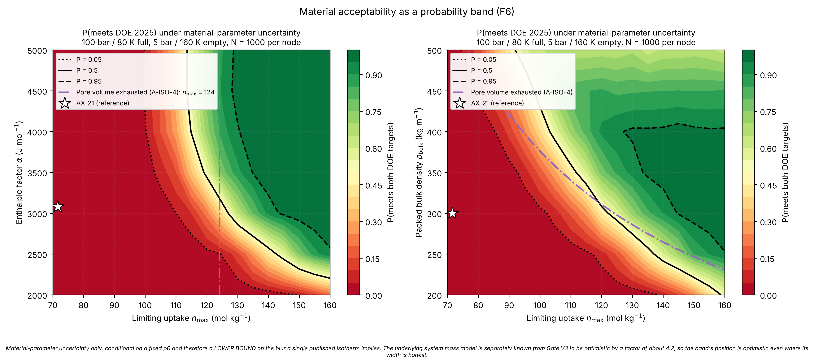

# h2star

**An open, uncertainty-aware materials-to-system model for sorbent-based
hydrogen storage.**

A materials paper reports that a sorbent holds *x* weight percent hydrogen. A
vehicle engineer needs to know how many kilograms a complete tank delivers per
kilogram of tank. Those are different numbers, and the gap between them is large
and systematically misread. H2STAR computes the translation, then inverts it to
ask the question the literature almost never does: *what would a material have
to be* for a real system to meet the DOE targets?



The answer is a region, not a point, and the reason is the project's central
finding.

## The finding

The modified Dubinin–Astakhov parameters that describe a sorbent **are not
identifiable from the single-temperature isotherms the literature routinely
publishes.** Refitting 11 digitized points from a published AX-21 isotherm put
all four free parameters outside their pre-registered recovery bands, with
pairwise correlations of 0.91–0.99 and cond(JᵀJ) ≈ 1e14. The curve is
identifiable; the parameter vector is not.

Propagating that through the system model blurs the DOE-2025 feasibility
boundary over **32.1 mol/kg in limiting uptake — a quarter of the requirement
itself** (5–95% range 109.4 to 141.5 mol/kg, median crossing 125.6). A point
prediction of "the required limiting uptake" would quote three significant
figures for a quantity whose own range spans a quarter of its value.

So the deliverable is an uncertainty-quantified acceptability region with a
probability-banded boundary, and the case for curating multi-temperature,
provenance-tiered measurements is measured here rather than asserted.

## Quickstart

```bash
git clone https://github.com/AvinGupta-ship-it/h2star
cd h2star
python3 -m pip install -e ".[dev]"
python3 -m pytest                               # 303 passed, 1 xfailed
python3 scripts/make_all_figures.py --quick      # smoke test, ~20 s
python3 scripts/make_all_figures.py              # all eight figures, ~9 min
```

The xfail is deliberate and is Gate V3 (below). Python 3.11 or later.

To re-execute the notebooks as well — the last step of the clean-room
reproduction — add the notebook extra:

```bash
python3 -m pip install -e ".[dev,nb]"
python3 scripts/run_notebooks.py --check         # all eight, ~8 min
```

`--check` runs them without writing them back, so it answers "do these still
run?" without producing a diff. Notebook 07 is most of that time.

```python
from h2star import envelope, isotherm, system

material = isotherm.Material.from_yaml("data/materials/ax21.yaml")
engineering = system.EngineeringParams.from_yaml("data/engineering.yaml")

budget = envelope.evaluate_envelope(
    material, isotherm.ModifiedDA(material), engineering,
    P_full=100e5, T_full=80.0,      # Pa, K
    P_empty=5e5, T_empty=160.0,     # fuel-cell delivery floor
)
print(budget["GC"], budget["VC"])   # kg H2 per kg system, per litre system
```

## Read this before using a number from here

**The system mass model is optimistic by about a factor of 4.2.** That is
measured, not estimated: Gate V3 compared the model against the HSECoE AX-21
baseline and localized the discrepancy to the vessel, insulation and
balance-of-plant block. The model consequently places AX-21 activated carbon
*above* the DOE 2025 gravimetric target, which AX-21 does not achieve in
reality.

Relative comparisons at a fixed envelope survive this, because a bias in a
shared denominator cancels in a ratio. Absolute capacities do not.
[`docs/known_limitations.md`](docs/known_limitations.md) states every limitation
with its magnitude and what each one forbids.

## Validation gates

Tolerances were pre-registered in
[`docs/validation_plan.md`](docs/validation_plan.md) before each comparison ran;
that file's git history is the evidence.

| Gate | What it tests | Verdict |
|---|---|---|
| V1 | EOS wrapper vs NIST hydrogen density | **PASS** — max error 4.992e-5 vs a <0.1% floor |
| V2.1 | Isotherm curve vs digitized AX-21 | **PASS** — RMSE 1.109 vs 1.5 mol/kg |
| V2.2 | Parameter recovery from one isotherm | **FAIL by design** — the likelihood is a ridge |
| V2.3 | Isosteric heat vs the 4–7 kJ/mol carbon band | **PASS** — analytic agreement to ~1e-15 |
| V3 | System capacity vs the HSECoE AX-21 anchor | **documented FAIL** — mass block ~4.2× light |
| V4 | UQ and Sobol machinery | **PASS** on all clauses |

Two gates failed. Both are results. V2.2 is the non-identifiability finding
above. V3 localizes a model limitation to a named block and quantifies it, which
is what makes every other number here interpretable — and it was not chased to a
pass, because re-sourcing the vessel model after seeing the mass it would have
to produce is fitting to a known answer.

## What the model finds

- **Volumetric capacity is the binding constraint**, not gravimetric, across
  both swept material-property planes and the whole forward operating map.
- **Binding energetics matter an order of magnitude more at ambient than at
  cryogenic conditions** (Sobol total-order index for α: 0.017 → 0.165). At
  cryogenic conditions the adsorbed-phase volume and the limiting uptake
  dominate. A materials chemist optimising for a cryogenic system should work
  on how much the sorbent holds; one optimising for ambient has to work on how
  tightly it binds.
- **The requirement sits at the edge of physical coherence.** The adsorbed phase
  grows with limiting uptake by two independent accounts and must fit the pore
  volume the packing leaves, which caps uptake at 104.9–124.1 mol/kg — at or
  below the 125.6 mol/kg the map requires. Meeting the target needs uptake
  *and* pore volume together, and more pore volume means packing less densely,
  which costs the volumetric capacity that is already binding.
- **Carbon nanotubes, on the best available provenance, deliver 0.88× the
  system capacity of AX-21 activated carbon** — a sorbent characterised in the
  1980s. No entry passing a physical-consistency screen exceeds AX-21.
- **That screen rejects exactly the two contested CNT values in the corpus.**
  Liu 1999's 4.2 wt% implies a limiting uptake beyond both pore-volume limits;
  Wang Qikun 2002's 8.0 wt% is reproduced by no limiting uptake at all. Neither
  rejection uses the experimental evidence raised against those values at the
  time — and Liu's own laboratory later published a correction.

## Reproducibility

- Every number behind every figure is deterministic under a fixed seed, and the
  eight figures (nine PNGs — F7 draws one per output) are byte-identical for a
  given Matplotlib and FreeType version. Verified by regenerating them from a
  fresh clone in a separate virtual environment and comparing SHA-256:
  nine of nine identical across Python 3.11 vs 3.13, NumPy 2.4.6 vs 2.5.3 and
  SciPy 1.17.1 vs 1.18.1. Byte-identity does not extend across Matplotlib or
  FreeType versions, which rasterise glyphs differently between releases; the
  numbers do.
- That holds because `viz.FIGURE_RCPARAMS` pins the font and hinting a figure is
  drawn with, instead of inheriting them from the host. An earlier release drew
  its figures under a font the development container supplied and no dependency
  declared, which made them unreproducible anywhere else while leaving every
  plotted number correct — see `docs/known_limitations.md`.
- `scripts/make_all_figures.py` is the **sole writer** of `figures/`. The
  notebooks show their figures inline and write nothing, so executing them
  cannot replace a published figure; `tests/test_notebook_hygiene.py` enforces
  that, along with the rule that no notebook defines a function. Every notebook
  resolves its paths from the repository root and is committed executed.
- Gates V1–V4 run as `@pytest.mark.validation` tests on every push, so the suite
  certifies the science rather than only the plumbing.
- `@pytest.mark.provenance` tests walk every file under `data/`: each parses,
  attributes its numbers, declares its units, and — for the engineering
  parameters — parses as numbers rather than strings, which is the PyYAML
  scientific-notation trap.
- No value, DOI or reference in this repository comes from model memory. Two
  papers in the CNT corpus print no DOI, and the corpus records that rather than
  supplying one.
- CI runs on `ubuntu-latest` and `macos-latest`, Python 3.11 and 3.12.

## How this fits together

Three projects, one question. [**HyCAN-DB**](https://doi.org/10.5281/zenodo.23231985)
curates what the field has measured. **H2STAR** converts measurements into
system-level consequence and derives what a material would have to be.
Laboratory work on electron-irradiated carbon nanomaterials supplies the
experimental ground.

The connection is not thematic. H2STAR's carbon-nanotube case study is drawn
entirely from HyCAN-DB's corpus, and H2STAR's central finding — that the
published data does not determine the parameters a system model needs — is the
argument for HyCAN-DB's provenance tiering, reached independently from the model
side.

## AI assistance

Disclosed in full in [`docs/ai_usage_log.md`](docs/ai_usage_log.md), session by
session, including a dated entry recording where the division of labour changed.
Implementation code, analysis, derivational reasoning and documentation prose
were produced with AI assistance under the working format that log describes.
Scientific sign-off, every hand-pinned anchor and tolerance, verification
against publisher records, and the final verdict on what the model may claim are
the author's.

## Citation

See [`CITATION.cff`](CITATION.cff). A Zenodo DOI will be minted at the `v0.2.0`
release and added here.

## License

MIT. See [`LICENSE`](LICENSE).
